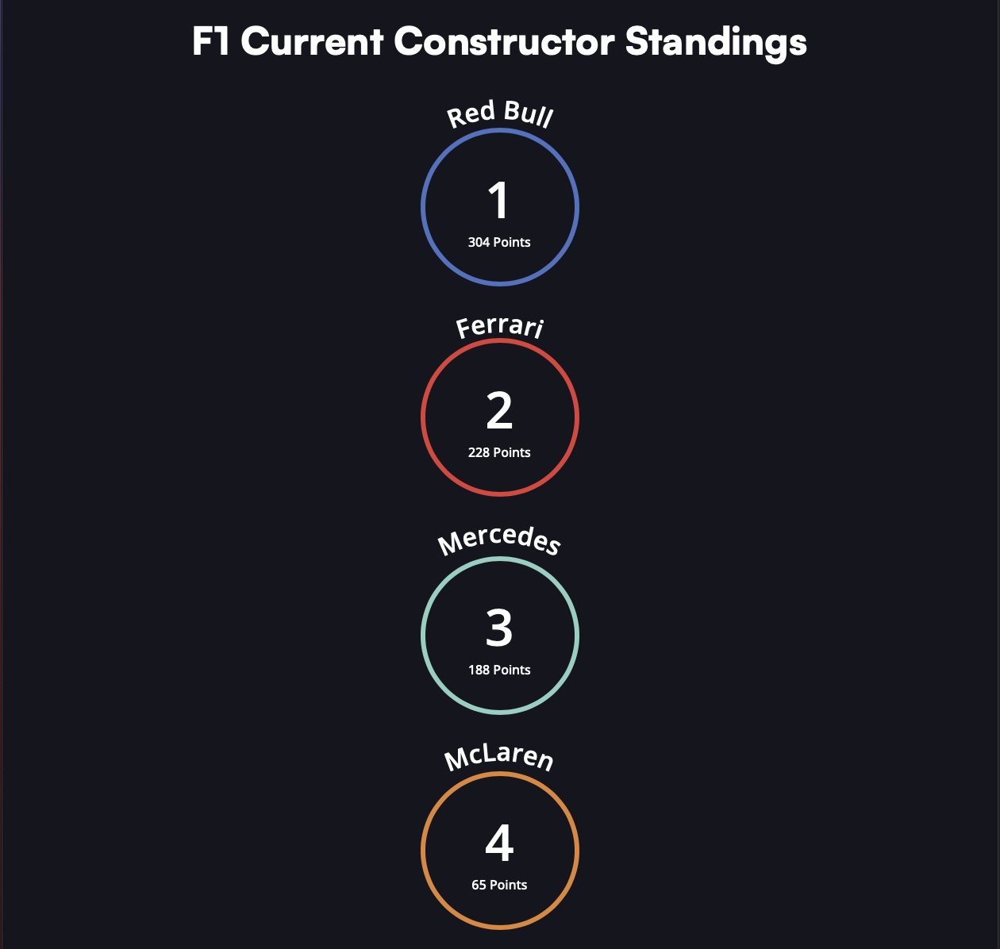

# circle-type

[Check out the circle-type project](https://formula-1-constructor-standings.netlify.app/)

A simple web page that dislays the current standings for Formula 1 teams. Making use of the Circle Type Library and the the Ergast Developer API.

## Citations

- [Circle Type Library](https://circletype.labwire.ca/)

- [Ergast Developer API](https://ergast.com/mrd/)

